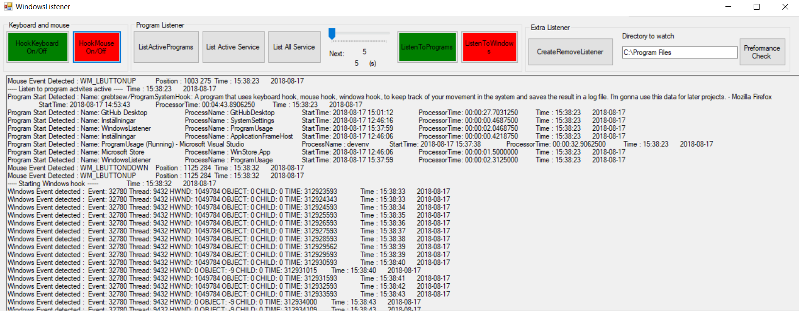

# ProgramSystemHook
A program that uses keyboard hook, mouse hook, windows hook, to keep track of your movement in the system and saves the result in a log file. I'm gonna use this data for later projects.

A program system hook to collect data for future purposes!

This program have the following functions:

* Hook keyboard
* Hook mouse
* Hook windows
* Hook program listener
* Show preformance
* Show services
* Timed starter of functions above

See image below:

